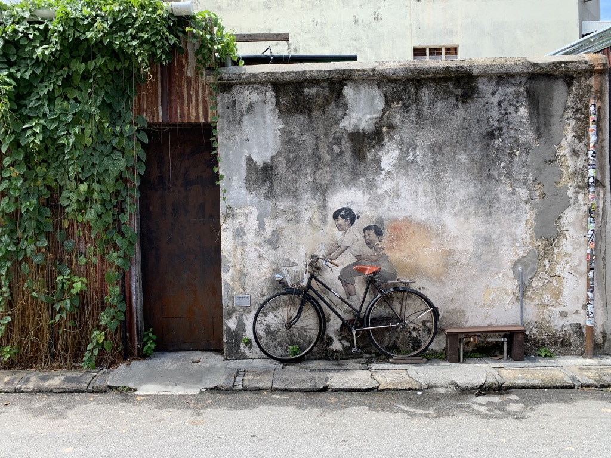
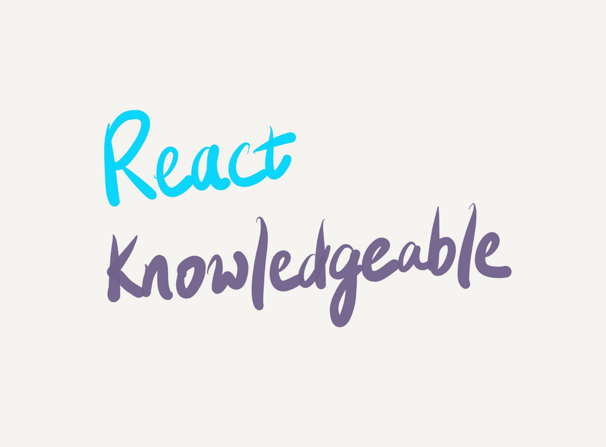
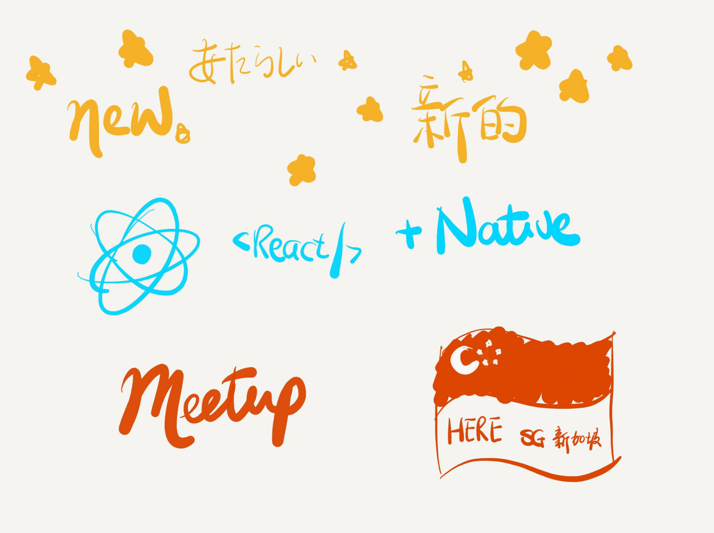
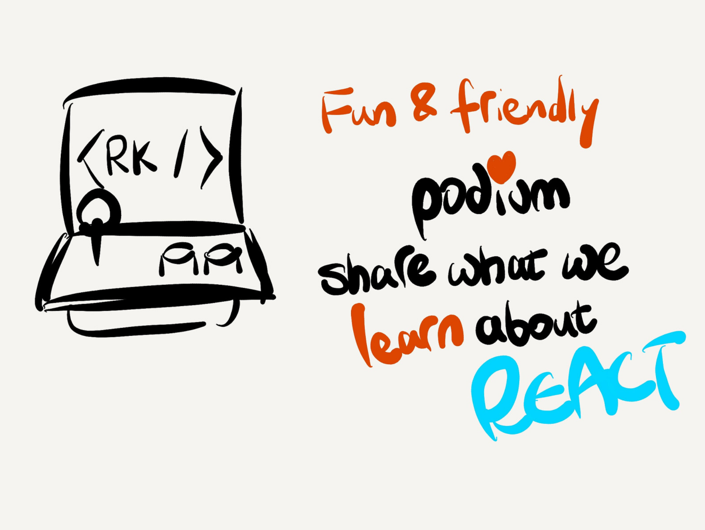
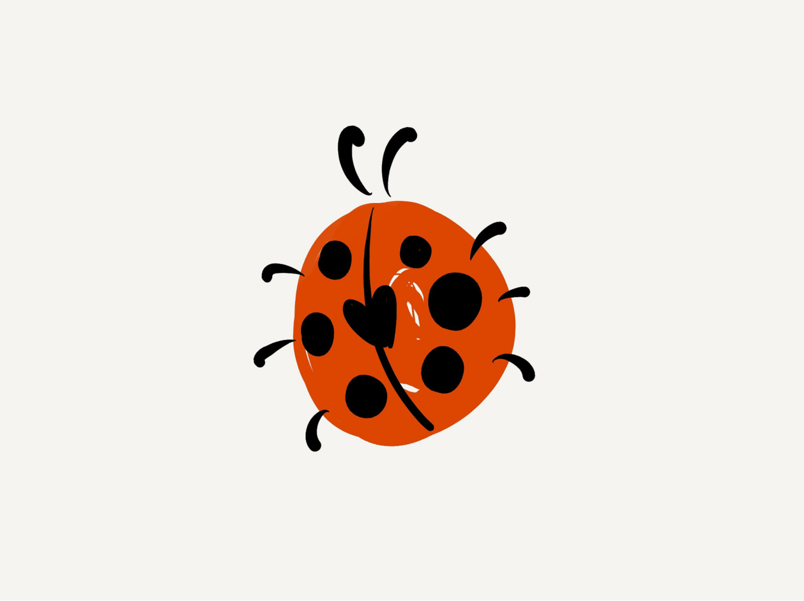
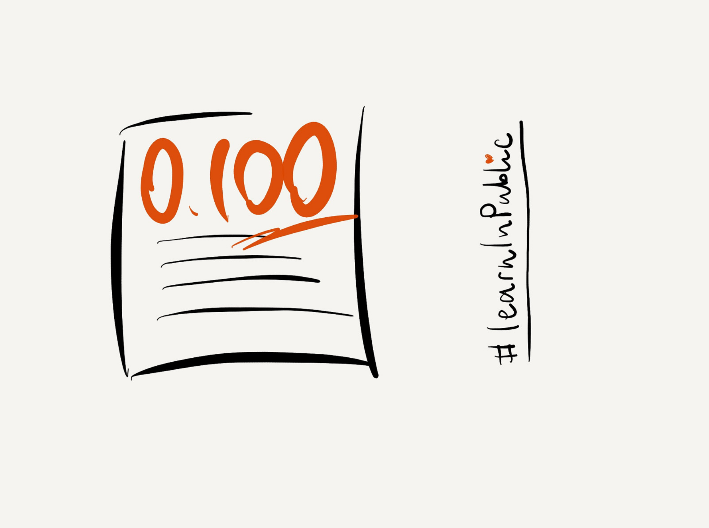
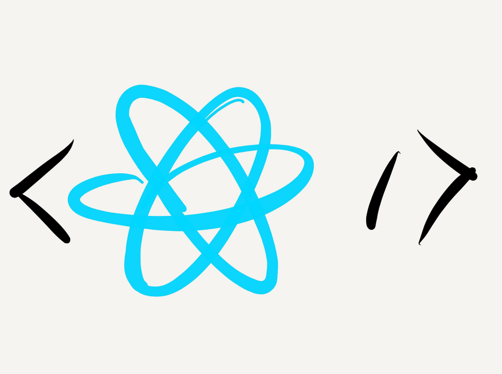
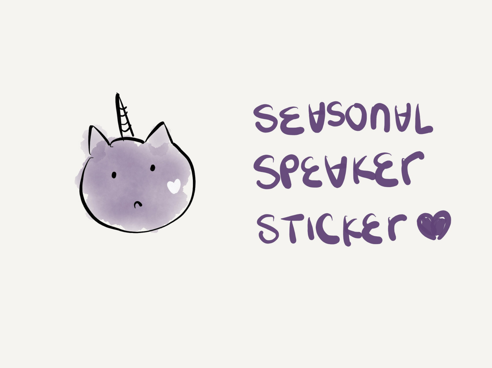
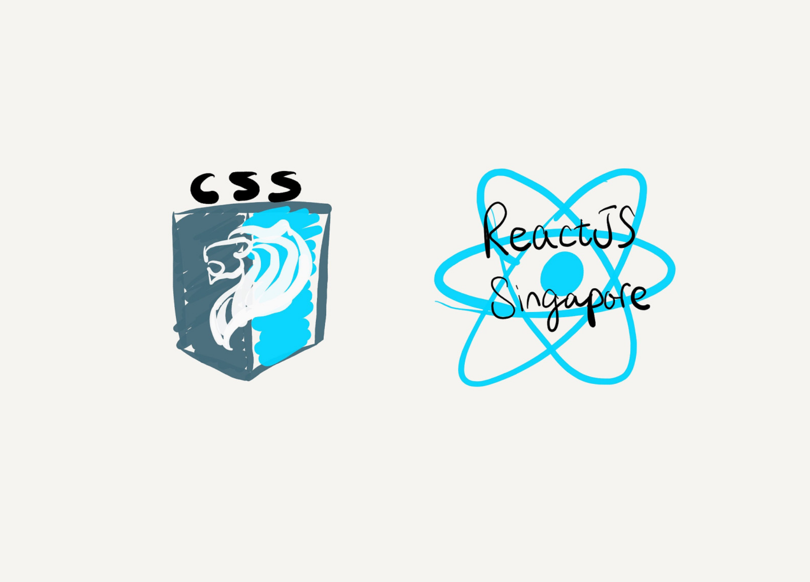

Me and [two](https://twitter.com/yishusee/) [more](https://twitter.com/kenleesm) RK kids went to [ReactJS Singapore July 2019 Edition](https://www.meetup.com/React-Singapore/events/260564102) to introduce `<RK⚡️ />` to this town today.

<!-- excerpt ends -->

So we're starting `<RK⚡️ />` in Singapore. Since we're an infantry meetup and people don't know about us, we figure we'd run around meetups to tell people about it. Normally how it goes is that most meetups here in Singapore has an announcement section at the end of each event. So that'll be what we aim at.

As a side track, I took a break a couple of weeks ago where I visited Penang with [Xinling](https://twitter.com/yosriady), a designer from our team. This girl has been my moral support all along. She's always very delightful and that matched the suns and the chills in Penang.

On the last day of our trip, I was telling her that I'd be introducing RK to this town and she agreed to hear my talk and to give feedback. But, as the theory goes – first time rehearsing a talk always goes disastrous – that ended up me wanting to bury my face in my flat white after babbling five minutes of nonsense.

As a designer Xinling is constantly drawing. And as a not-a-very-visual person I even got affected by her dedication. She was drawing a postcard out of a photo she took in a street of Penang. I requested that I contribute to it so she allowed me to plaid one of the fillings. And it didn't go too bad (how bad can a plaiding go anyway). Before our flight she was drawing another card for her mom. Dedication is infectious, really. So I started drawing with my iPad as well.

I could not get RK out of my mind after running the talk for a first time with her. So I started doodling RK. How can a non-visual person "doodle" RK? Well, I guess just write it out...

Then the next slide I drew was really very amateurish. Basically I just drew-out-loud what I thought of.

We boarded our flight back to Singapore. For once in my lifetime I dedicated my whole flight to one single task that got my full attention. And so the headline of RK ended up looking like this, it has its new logo designed by my friend [Huijing](https://twitter.com/hj_chen), and a line that says what we love about RK:

I was thinking about what I wanted to say about RK. I have so much to say and doodles just came out one after another. This bug, for instance. I was intended to say that "bugs fit well into a lightning talk, you get technical quickly, _and they are great for storytelling_". But you all know now that I forgot the last pitch. Life `¯\_(ツ)_/¯`.

Then this next slide about speaking and learning is subtly mocking Flow. If you were at [my talk last month about Flow](https://uuei.io/talks/flow-be-happy/), you know what I'm talking about.

The React logo seemed not so hard -- until I tried. You need to get the angle right. That was like some hundred times of drawing skinny circles:

Now here comes my favorite one: the RK speaker slide! That is _not_ the RK speaker sticker, by the way. The real RK speaker sticker – you'll only know when we launch :] But hopefully this one is cute enough as a mascot for RK? 

For the recent half a year getting involved with the local tech meetups, I feel gratefully accepted by the amazing communities and friends we have here. Shouting outs to [SingaporeCSS](https://singaporecss.github.io/) and [React Singapore](https://www.meetup.com/React-Singapore/) meetups, both of who have been of tremendous support to get `<RK />` going in town.

`oembed: https://twitter.com/SingaporeCSS/status/1152120843142516736?s=20`

That roughly summarizes my slides. And now that I have this deck, it all became natural to me that I'd do this as a lightning talk. We're about to run a meetup solely on lightning talks so why not. If you were here at ReactJS meetup tonight, you've seen it all. It's far from perfect. I dry ran this a few more times yesterday and today. I squeezed one more in on our way there. Truth be told, even my co-organizer [Ken](https://twitter.com/kenleesm) agreed that they all went disastrous 😅 But I'm really very grateful that he didn't tell me until _after_ the actual talk, which went alright, I guess.

A lot of people like the slides I doodled and some asked about the tools I used creating those slides. It's actually not a tool for slides, it's a drawing tool called [Paper](https://www.fiftythree.com/). But it worked out well for these slides and I had a lot of fun drawing them! If you like the slides, [here](https://noti.st/wgao19/0zB2FW/introducing-react-knowledgeable) is the notist page for this presentation where you can find all the slides :)